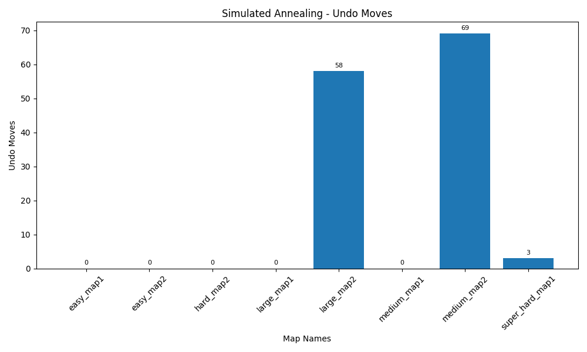
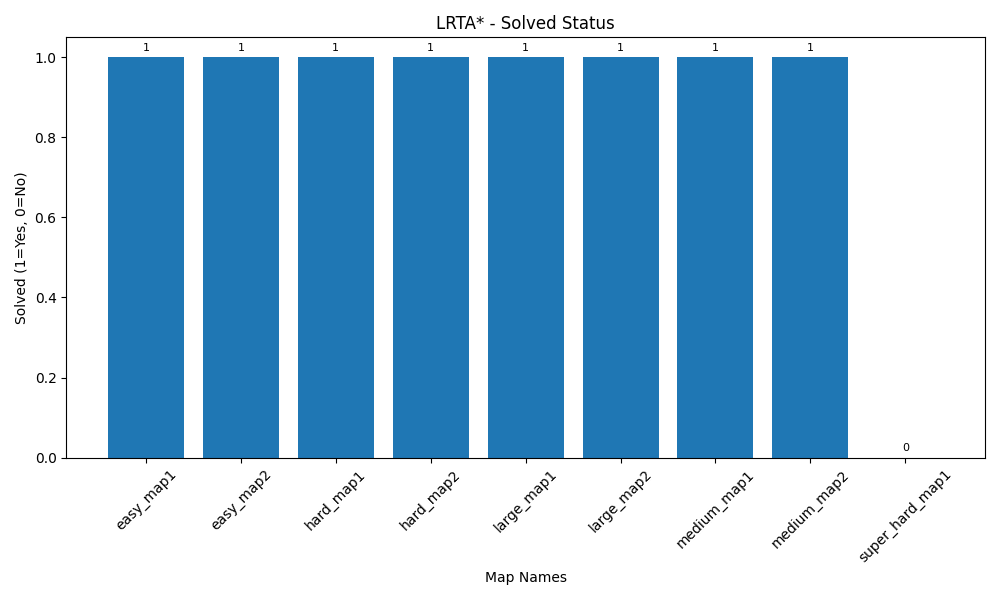
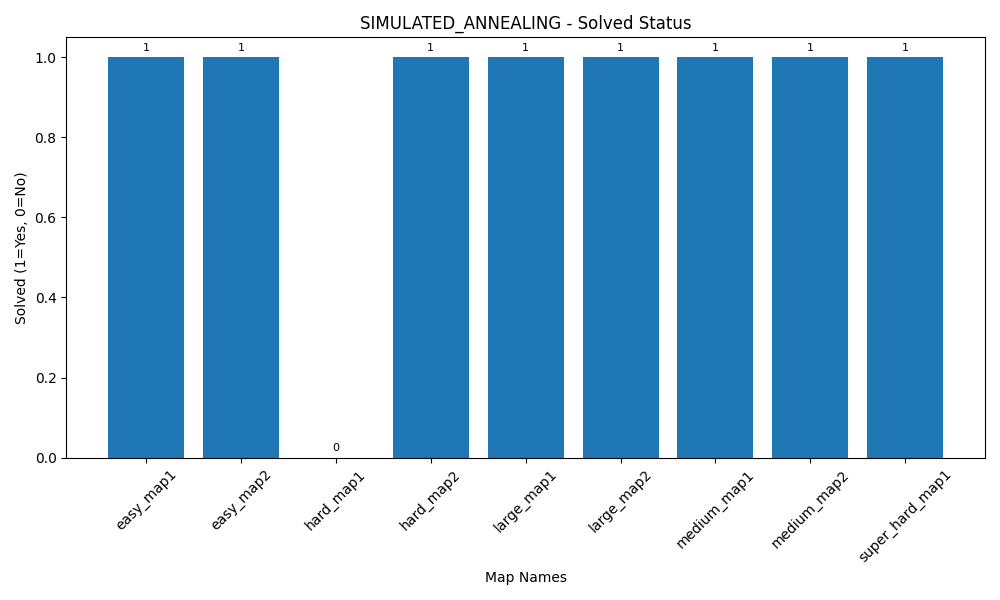
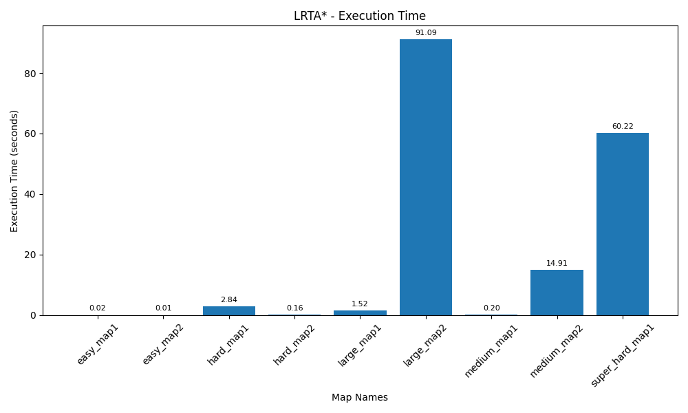
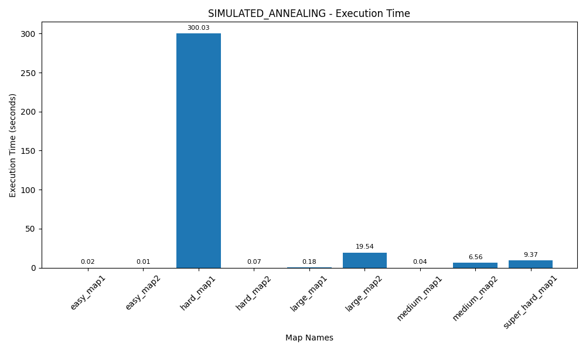
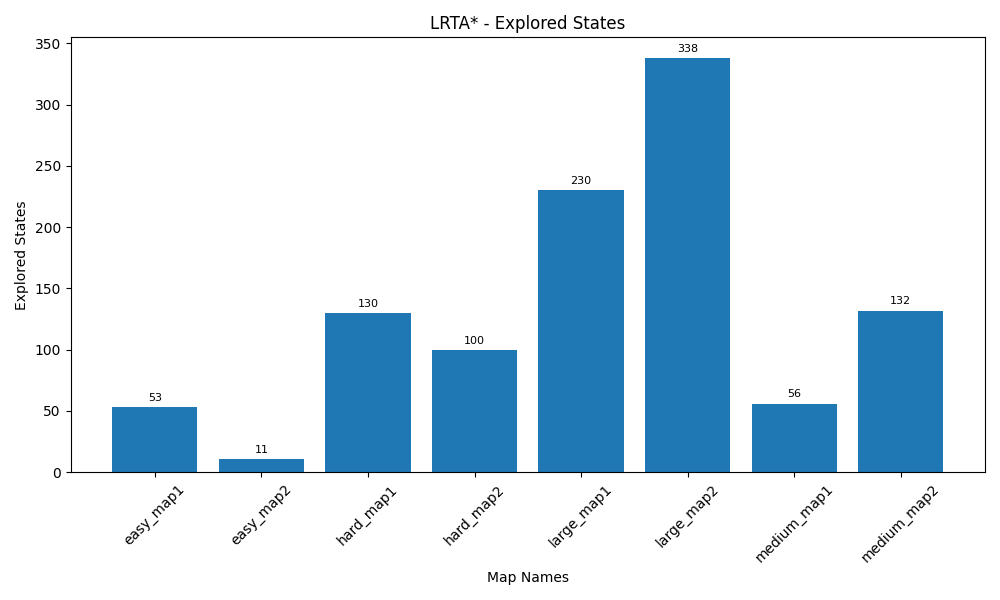
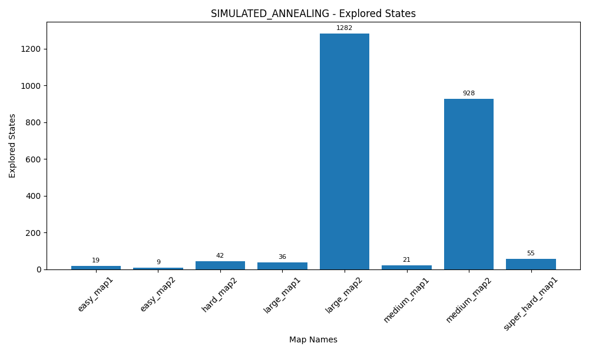

# Sokoban Solver

## Running the script

```python main.py [-h] [--save-images] {lrta*,simulated-annealing} input_file```

If you wish to run all the tests and generate graphs, set ```RUN_ALL``` to ```True``` inside ```main.py```.

## LRTA* implementation

The first step was coming up with a heuristic for a given state of the game. An intuitive choice was to start with
the distances from boxes to targets + the distance from the player to the nearest box. I decided to give the target
distance a higher weight, because bringing the boxes closer to targets is more important than bringing the player
closer to boxes. I also decided to add minimal deadlock detection by cheking if the box is near 2 adjacent corners.
This first heuristic did not work at all, the player kept going back and forth because he constantly tried to get near
a box, even if the targeted side was wrong. I decided to add a penalty for reapeating moves, which worked for the easy
maps.

Next step was solving the medium maps. For medium_map1, a simple fix was adding a penalty for moving a box off a target.
This did not work for medium_map2, and after trying several small adjustments (for instance, excluding occupied targets
when calculating sum of box distances), I decided to go with a restart approach. Since LRTA* stores updated heuristics
for all the explored states, this means that I could restart the map whenever no meaningful progress had been made for some time, and the player could avoid the states that lead to deadlocks in the future. This approach was pretty successful, the only maps still failing were large_map2 and super_hard_map1.

Last step was optimising the heuristics in order to get a solution for large_map2. One such change was using A* algorithm
to compute the distance from a box to a target. Another change was making the reset_threshhold more generous. What finally
worked was making a smarter system for calculating the heuristic for the distance from player to box. Firstly, I decided
to consider only sides of the boxes that could be reached, instead of simply going for box positions. Secondly, I decided
to ignore sides which would result in a deadlocked. These final changes resulted in a solution for large_map2.

Result: all maps solved except SUPER_HARD_MAP1  
All the solutions were made with no undo moves, because of the restart system.

## Simulated Annealing implementation

Implementing simulated annealing was much more difficult, because a restart system was not compatible with this type
of algorithm. An alternative could have been a smarter deadlock detection system, but I deemed this approach too
complex and decided to go for the simpler route: using undo moves.

The first issue with the already implemented heuristics was that the player could make random moves instead of making
moves towards boxes. A relatively simple fix was using the simulated annealing algorithm for choosing the next box move,
instead of choosing the next move. This meant that at each iteration, the player would explore all the possible box moves
by using a fill algorithm to navigate the regular moves.

This worked pretty well, but the player still was unable to solve more difficult maps, like medium_map2. One improvement
was using a reheating system (somewhat similar to the reset system used in LRTA*), but that did not help much. Then, I decided to make a significant change to the state heuristic: instead of simply calculating the distance from each box
to the nearest available target, the function would assign a target to each box, and by going through all the possible
permutations, it would return the optimal target assignment and the respective sum of costs.

One more improvement I made was adding a penalty for undo moves, in order to improve solution quality.

Result: all maps solved except HARD_MAP1  
The solutions used plenty of undo moves

## Comparing the 2 algorithms

The first obvious comparison is the solution quality: while the LRTA* solution uses no undo moves, the Simulated Annealing
one does use undo moves. Despite this, most solutions found by simulated annealing use no undo moves, and only MEDIUM_MAP2, LARGE_MAP2 and SUPER_HARD_MAP1 required undo moves (with 69, 58 and 3 undo moves, respectively).



Solutions obtained: both algorithms managed to solve almost all maps, but they struggled with different maps. LRTA* did not solve SUPER_HARD_MAP1 because it player didnt manage to find the optimal move before resetting, which eventually
lead to starting the game in a deadlocked state (```h[initial] = float('inf')```). Simulated annealing did not solve
HARD_MAP1 because of TTL. Interestingly, despite not being able to solve HARD_MAP1, the simulated annealing algorithm
managed to solve SUPER_HARD_MAP1 in a relatively short time and number of moves.





Execution time: Simulated annealing performed much faster than LRTA*. An obvious cause is the lack of restarts in
the simulated annealing implementation, if the player makes a mistake, he eventually makes an undo move and continues
until he finds a solution. Meanwhile, if the player makes a mistake in the LRTA* algorithm, he keeps playing until he
realises that no progress has been made, at which point he has to restart the game and replay all the relevant moves.





Explored states: While simulated annealing found faster solutions (less moves) for most maps, it struggled to find good
solutions for more complex maps, like MEDIUM_MAP2 and LARGE_MAP2, with over 900 explored states. Meanwhile, the performance for LRTA* was more consistent, with most maps having between 100 and 300 explored states. Interestingly,
the solution found for SUPER_HARD_MAP1 was very efficient, with only 56 explored states and 3 undo moves.





## Conclusions

Despite implemeting simulated annealing with undo moves and less restrictive heuristics, it performed much better than
expected, and in a lot of cases it outperformed LRTA*. Excluding SUPER_HARD_MAP1, LRTA* seems to perform better when solving more complex maps, while Simulated Annealing works much better for simpler maps.

All the solutions have been saved to ```./images/{map_name}```.
